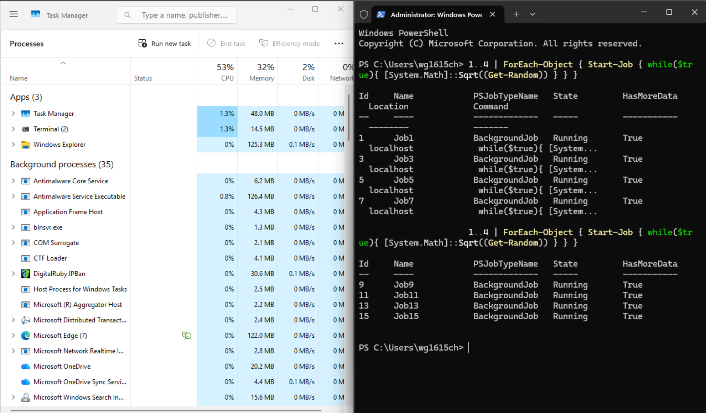

# CVNP1606 Week 5: Performance and Startup Triage

Ticket CVNP1606-W05-005, ACME-BRANCH-WS01

---

## Objectives

- Simulate a slow startup condition on a Windows 11 VM
- Capture before-metrics with Task Manager, PowerShell, and Resource Monitor
- Identify the bottleneck and write a hypothesis backed by metrics
- Apply one safe remediation and document it in a change note
- Capture after-metrics with the same tools and compare before and after

---

## Tools Used

- Proxmox VE qm commands: list, roll back, and start the VM snapshot
- git: confirm the repo was pushed before rollback and restore it afterward
- PowerShell Start-Job: simulate sustained CPU load
- Task Manager: view CPU, memory, and disk usage, startup apps, and end the load process
- Get-Process: list the top 10 processes by CPU time
- Resource Monitor: identify which process was responsible for the load

---

## Configuration

### Ticket Information

- Ticket ID: CVNP1606-W05-005
- Submitted by: Riley Chen, ACME Branch Manager, via Nexus helpdesk
- Affected system: ACME-BRANCH-WS01
- Business impact: High. Riley hosts client-facing meetings, and the freezes disrupt video calls and presentations.

### Scenario Summary

Riley Chen reported that her meeting workstation freezes for 10 to 15 seconds when switching applications, worst in the first 10 minutes after login. I simulated the problem on my Windows 11 VM with a background CPU load, measured the system with Task Manager, PowerShell, and Resource Monitor, and found that a PowerShell process was the top CPU consumer. I ended that process, and CPU usage dropped from 51% to 20% in Resource Monitor. Riley's workstation should now have enough processor headroom to switch between applications without freezing.

---

## Step 1: Confirm the repo is pushed before rollback

```
git fetch
```

```
git status
```

```
git remote -v
```

Expected output includes: Your branch is up to date with 'origin/main', nothing to commit, working tree clean, and the origin URL.

Status: Complete. The repo was fully pushed, so the rollback would not lose any work.

## Step 2: Restore the baseline snapshot

```
qm listsnapshot 101
```

```
qm rollback 101 W01_CleanBaseline
```

```
qm start 101
```

Expected output includes: the snapshot list, then the VM starting from the baseline.

Status: Complete.

## Step 3: Simulate CPU load

```
1..4 | ForEach-Object { Start-Job { while($true){ [System.Math]::Sqrt((Get-Random)) } } }
```

Expected output includes: four BackgroundJob entries with State Running.

Status: Complete. The command was run twice for eight jobs. See Troubleshooting Notes, Issue 1.



## Step 4: Capture before-metrics

Task Manager showing CPU, memory, and disk.


```
Get-Process | Sort-Object CPU -Descending | Select-Object -First 10
```

Expected output includes: the top 10 processes by total CPU time.


Task Manager Startup apps tab.


Status: Complete. Details in before-metrics.md.

## Step 5: Identify the bottleneck in Resource Monitor

Opened from Task Manager, Performance tab, Open Resource Monitor.

Expected output includes: CPU, disk, and memory activity by process.


Status: Complete. powershell.exe PID 1132 was the top CPU consumer at 20.54 Average CPU, with total CPU at 51%. The hypothesis is in before-metrics.md.

## Step 6: Apply the remediation

Task Manager, Processes tab, right-click powershell.exe, End task.

Expected output includes: the powershell.exe process removed from the list.


Status: Complete. Details in change-note.md.

## Step 7: Capture after-metrics

Task Manager Performance tab.


```
Get-Process | Sort-Object CPU -Descending | Select-Object -First 10
```


Resource Monitor.


Status: Complete. Comparison in after-metrics.md.

## Step 8: Run the evidence collection script

```
.\collect-evidence.ps1
```

Expected output includes: evidence-report.txt with all required files showing FOUND.

Status: Complete. evidence-report.txt shows all required files as FOUND.

---

## Before and After Comparison Summary

- Resource Monitor CPU usage: 51% before, 20% after
- Task Manager CPU: 57% before, 11% after
- powershell.exe PID 1132 Average CPU: 20.54 before, no longer running after
- Hard Faults/sec: 20 before, 7 after
- Used Physical Memory: 43% before, 25% after
- Disk Highest Active Time: 21% before, 14% after

The remediation worked. Full comparison in after-metrics.md.

---

## Troubleshooting Narrative

**1. What performance symptom did you observe or simulate, and what was the business impact for Riley?**

I simulated the symptom from the ticket by running a background CPU load in PowerShell. Riley reported 10 to 15 second freezes when switching applications, worst in the first 10 minutes after login. What I observed was high CPU usage and sluggish, delayed response to inputs on the device. The business impact for Riley is high, because she hosts client-facing meetings and the freezes disrupt her video calls and presentations.

**2. What evidence did you check first, and what did it show?**

The first thing I checked was Task Manager to see what was running and to see how much each application was using for CPU, Memory, and Disk. What I found was a moderate to high usage of CPU.

**3. What was your bottleneck hypothesis, and what specific metric supported it?**

Based on the data, CPU usage is 51%, and CPU saturation is high. I believe something is running in PowerShell that is significantly impacting CPU usage.

**4. What remediation did you apply, and why was it safe to do without escalating?**

The action I took was closing powershell.exe since I had created the load. In a real-world situation I would have closed the application draining the CPU, Memory, or Disk. Since Riley stated that the issue was in the first few minutes of starting her device, I would have most likely also gone into the Startup apps tab of Task Manager and disabled the application that was causing the usage at startup. In my scenario it was safe because I created the cause of the usage. In a real-world situation it would depend on what the application creating the drain on resources was. If it was not a critical application I would disable it from startup.

**5. How did you verify the result, and did the metrics improve?**

I used Task Manager and the Resource Monitor to view and verify that closing the powershell.exe application lowered the CPU usage, which in this case it did do.

**6. What would you do if the metrics did not improve after your remediation?**

If there was not an improvement I would have to redraw my hypothesis and reevaluate the application/s that are draining the usage creating the sluggish conditions. If appropriate I would stop them and possibly disable them.

---

## Troubleshooting Notes

### Issue 1: Simulated CPU load too low with four jobs

Command as given in the assignment:

```
1..4 | ForEach-Object { Start-Job { while($true){ [System.Math]::Sqrt((Get-Random)) } } }
```

Root Cause: With the four background jobs from the assignment running, total CPU usage only reached about 27%. That was not enough load to clearly simulate the CPU saturation described in the ticket.

Resolution: I ran the same command a second time, which started four more jobs for a total of eight, Job1 through Job15, as shown in before-load-jobs.png.

Result: With eight jobs running, CPU usage rose to 51% in Resource Monitor and 57% in Task Manager. Even with twice the number of jobs the assignment called for, the load did not go higher than that, but it was enough to clearly identify the PowerShell process as the top CPU consumer for the before-metrics.

---

## Portfolio Card

### What I Can Do Now

I diagnosed CPU-driven freezing on a client-facing Windows workstation with Task Manager, Resource Monitor, and PowerShell, applied one safe and reversible fix, and backed up the result with measured before and after data another technician could verify.

---

## AI Use Statement

See ai-disclosure.md in this folder.

---

## Files In This Folder

- README.md
- before-metrics.md
- change-note.md
- after-metrics.md
- ai-disclosure.md
- collect-evidence.ps1
- evidence-report.txt
- screenshots/
  - before-load-jobs.png
  - before-taskmanager.png
  - before-getprocess.png
  - before-startup-apps.png
  - before-resmon.png
  - remediation-process-ended.png
  - after-taskmanager-performance.png
  - after-getprocess.png
  - after-resmon.png