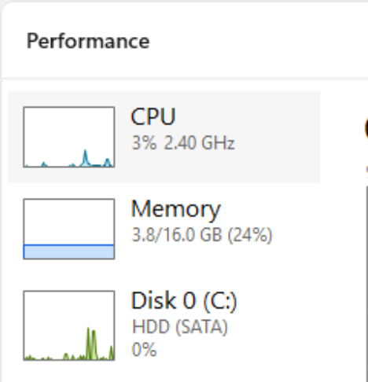
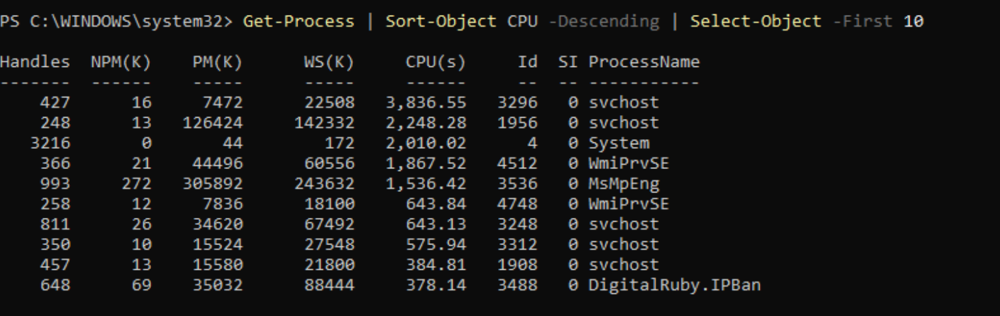
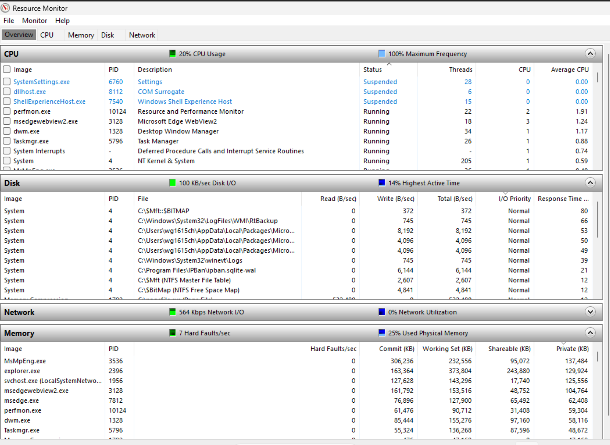

# After Metrics: CVNP1606 Week 5

Ticket CVNP1606-W05-005, ACME-BRANCH-WS01

The after-metrics were captured with the same tools in the same order as the before-metrics: Task Manager, then the Get-Process command in PowerShell, then the Resource Monitor Overview tab. All captures were taken a few minutes after powershell.exe PID 1132, the process generating the CPU load, was ended in Task Manager.

## Task Manager

CPU: 57% before, 11% after. Improved.

Memory: 31% before, 27% after. Slightly improved.

Disk: 2% before, 13% after. Increased. Resource Monitor showed disk active time going down over the same period, from 21% to 14%, so this reading appears to be a brief spike at the moment of capture rather than a sustained increase.

The Task Manager Performance tab after remediation showed CPU at 3%, memory at 3.8 of 16.0 GB or 24%, and disk at 0%.

## Get-Process, top 10 by CPU

The before and after lists show the same ten system processes in nearly the same order: svchost, System, WmiPrvSE, MsMpEng, and DigitalRuby.IPBan. The CPU column is total processor time in seconds since each process started, so long-running system processes stay at the top of the list. The top entry, svchost PID 3296, went from 3,826.55 to 3,836.55 seconds. No powershell.exe entry appears in either list. Result: unchanged, which is expected for a cumulative counter.

## Resource Monitor Overview

CPU usage: 51% before, 20% after. Improved.

powershell.exe PID 1132 Average CPU: 20.54 before. After, no powershell.exe processes appear in the CPU list. Resolved.

Disk I/O: 356 KB/sec before, 100 KB/sec after. Improved.

Disk Highest Active Time: 21% before, 14% after. Improved.

Hard Faults/sec: 20 before, 7 after. Improved.

Used Physical Memory: 43% before, 25% after. Improved.

## Conclusion

We accomplished what we wanted with the remediation. After ending the running of the background load by stopping the PowerShell process, the overall CPU usage went down from 51% to 20% on Resource Monitor and from 57% to 11% on Task Manager, as well as removing all processes called powershell.exe from the CPU list. Memory use and hard faults also decreased. So Riley should now have enough processor room to switch between applications, which should help with the freezes she has been experiencing. If these freezes occur again during her next login, our next action would be to go into the Startup apps list and verify if the OneDrive.exe app is still enabled at its previous High impact level.

## Screenshots

