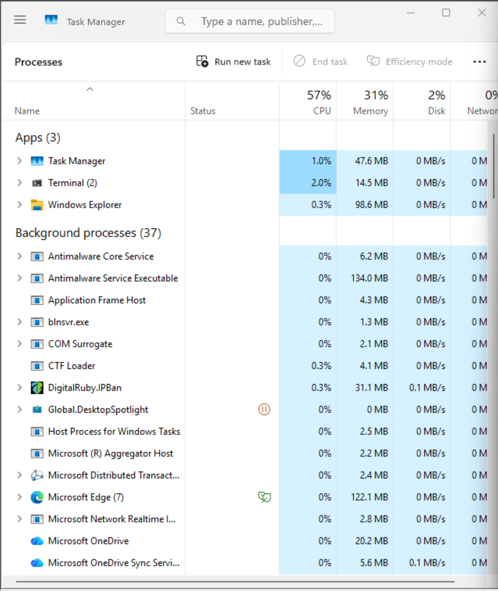
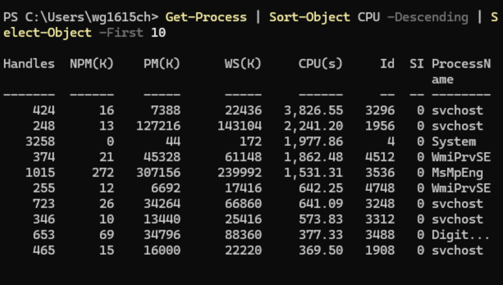
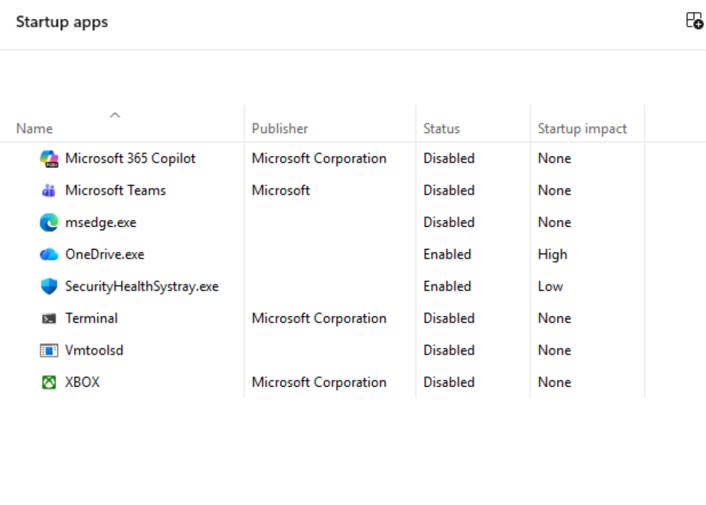
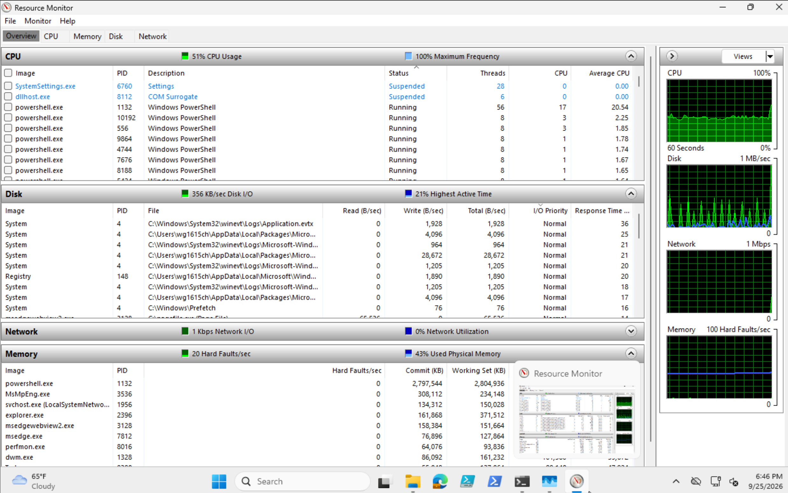

# Before Metrics: CVNP1606 Week 5

Ticket CVNP1606-W05-005, ACME-BRANCH-WS01

Load was simulated with the Option B background CPU loop, run as Administrator in PowerShell. Captures were taken after the load had run for at least two minutes. See README Troubleshooting Notes, Issue 1, for why eight jobs were used instead of four.

## Task Manager

CPU: 57%. Memory: 31%. Disk: 2%.

## Get-Process, top 10 by CPU

The top ten are system processes: svchost, System, WmiPrvSE, MsMpEng, and DigitalRuby.IPBan. The top entry is svchost PID 3296 at 3,826.55 seconds.

## Startup Apps

OneDrive.exe is enabled with High impact. SecurityHealthSystray.exe is enabled with Low impact. All other items are disabled.

## Resource Monitor Overview

CPU usage: 51%. powershell.exe PID 1132 Average CPU: 20.54.

Disk I/O: 356 KB/sec. Disk Highest Active Time: 21%.

Hard Faults/sec: 20. Used Physical Memory: 43%.

## Bottleneck Hypothesis

Based on the data, CPU usage is 51%, and CPU saturation is high. I believe something is running in PowerShell that is significantly impacting CPU usage.