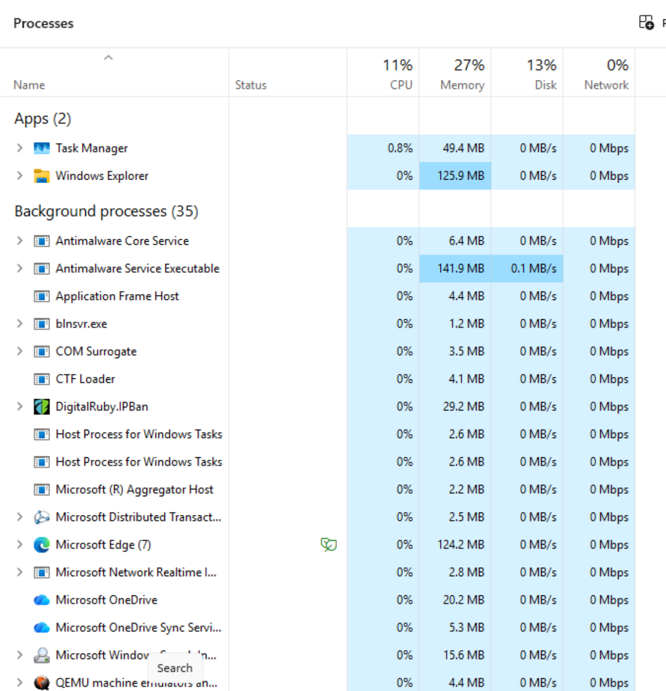

# Change Note: CVNP1606 Week 5

Ticket CVNP1606-W05-005, ACME-BRANCH-WS01

## What Was Changed

I ended powershell.exe PID 1132, the process that was running the background CPU load. PID 1132 was the Administrator PowerShell console where the load jobs were started. Ending it stopped all of the job processes along with it, and no powershell.exe processes remained in the Resource Monitor CPU list afterward.

## Tool Used

Task Manager. On the Processes tab, I right-clicked the powershell.exe process consuming the CPU and chose End task.

## Why This Remediation

The before-metrics pointed to CPU load from PowerShell. Resource Monitor showed powershell.exe PID 1132 as the top CPU consumer at 20.54 Average CPU, with total CPU usage at 51%. Ending that process addressed the cause directly.

Disabling a startup item would not have fixed it. OneDrive.exe was the only High impact startup item, but it was not using CPU in the before captures, and a startup change would only take effect at the next login. Freeing disk space did not apply either, since disk activity was low, with 21% Highest Active Time and no sign of low free space.

## Why It Is Safe and Reversible

powershell.exe is not svchost.exe, an antivirus service, or a system process. It was a user-started process running only the simulated load, so ending it did not affect Windows or any other application. No files, settings, or software were changed or removed. To reverse the change, open PowerShell again and, if needed, rerun the same command.

